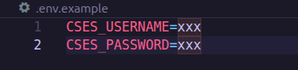
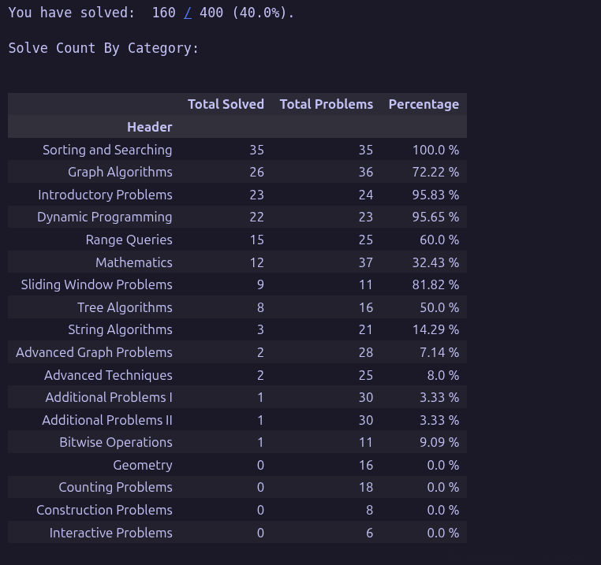
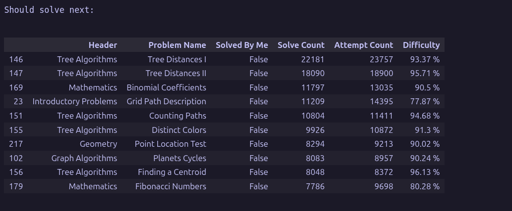

# CSES Progress Tracker
## How to use

1- Open terminal & cd into project directory

2- Create a python virtual environment
```bash
python3 -m venv .venv
```

3- Create a .env file like the example filled with real credentials




4- Run the notebook

## Output

### It should give you:

- **A brief on your progress**



---

- **A recommendation on what to solve next**



